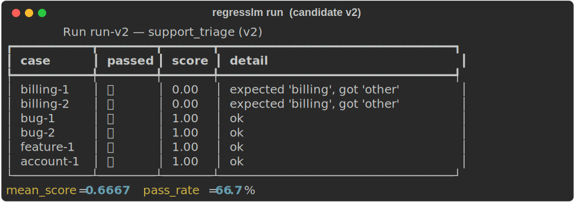
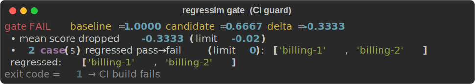
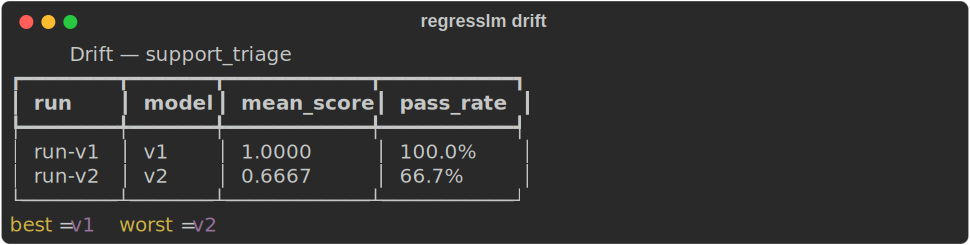

# RegressLM — Regression Testing for LLM & Agent Systems

> Treat prompts and models like code. Golden datasets, pluggable scorers (deterministic **+ LLM-as-judge**), a **CI gate** that fails the build when answer quality drops, and **drift tracking** across model versions.

  

The #1 unsolved problem in shipping AI: *"I tweaked a prompt / upgraded a model — did I just break something?"* Manual spot-checking doesn't scale and misses silent regressions. RegressLM makes LLM quality a **first-class CI check**, the same way pytest makes correctness one.

---

## The problem

You change a prompt to fix one bad case. It ships. Two weeks later you discover it quietly broke billing-ticket classification for 30% of users — no error, no alert, just worse answers. There was no `git diff` for behavior.

RegressLM gives you that diff:
- a **golden dataset** of cases with references/expectations,
- **scorers** that grade each output (exact/label/regex/json/numeric + LLM judge),
- a **gate** that compares a candidate run to a baseline and **fails CI on regression**,
- **drift** history so you can compare `claude-sonnet-4-6` vs `claude-haiku-4-5` head-to-head over time.

## Who uses it

- **AI / ML engineers** iterating on prompts and chains who need a safety net.
- **Eval / quality engineers** (a fast-growing 2026 role) owning model quality.
- **Platform teams** gating every prompt PR the way they gate code.

## What it proves (skills)

Test-harness design, a clean scorer abstraction (Protocol-based, extensible), **LLM-as-judge** with offline determinism for CI, baseline/candidate diffing, regression-gate semantics, drift analytics, and a CLI that drops straight into GitHub Actions. It's the *data-quality philosophy of [PromptLedger]/[FluxELT] applied to model behavior* — a coherent portfolio story.

---

## Architecture

```
 Golden dataset (yaml/jsonl)        Target (system under test)
 ┌───────────────────────┐         ┌─────────────────────────┐
 │ case: input,reference,│         │  input -> output         │
 │ expect{label,regex...}│         │  (your prompt/agent/clf) │
 └───────────┬───────────┘         └───────────┬─────────────┘
             │                                 │
             ▼                                 ▼
        ┌──────────────────── Runner ────────────────────┐
        │  for each case: run target, apply scorers      │
        │  Scorers: exact / contains / regex / numeric / │
        │  json_valid / label_match / llm_judge          │
        └───────────────────────┬────────────────────────┘
                                 ▼
                        RunResult (per-case scores, mean, pass-rate)
                                 │  persisted to RunStore
              ┌──────────────────┴───────────────────┐
              ▼                                       ▼
   Gate (candidate vs baseline)            Drift (runs over time, by model)
   • mean-score drop > limit  → FAIL       • score/pass-rate timeline
   • pass→fail regressions    → FAIL       • best/worst model
   exit 1  ⟶  breaks the CI build
```

| Module | Responsibility |
|--------|----------------|
| `schema.py` | Case / Dataset / Score / CaseResult / RunResult |
| `scorers/` | Deterministic scorers + `LLMJudge` (real) / `MockJudge` (offline) |
| `runner.py` | Execute target over dataset, score, aggregate; target crash → failing case |
| `store.py` | Persist runs; baseline pointer; history |
| `gate.py` | Candidate-vs-baseline regression decision (CI exit code) |
| `drift.py` | Cross-run / cross-model drift report |
| `cli.py` | `run`, `gate`, `baseline`, `drift` |

---

## Tech stack

**Python 3.10+ · Pydantic v2 · PyYAML · jsonschema · Typer + Rich · pytest · Docker**
Optional `anthropic` for the live LLM judge. CI runs fully offline via `MockJudge`.

---

## Quickstart

```bash
python -m venv .venv && source .venv/bin/activate
pip install -r requirements.txt && pip install -e .

# Full story: baseline -> regressed candidate -> gate catches it -> drift
REGRESSLM_BIN=regresslm bash scripts/demo.sh
```

---

## Screenshots

> Real captures of live output. Regenerate anytime with `python scripts/make_screenshots.py` (renders the actual Rich tables to SVG — no mockups).

**Candidate run** — a prompt change in v2 broke billing detection (2 cases flip ❌):



**CI gate** — fails the build (exit 1) and names exactly which cases regressed:



**Drift** — score/pass-rate across runs, best vs. worst model:



---

## Writing a dataset

```yaml
name: support_triage
cases:
  - id: billing-1
    input: "I was charged twice, please refund."
    reference: billing
    expect: { label: billing }          # used by label_match
  - id: api-1
    input: "Return the user as JSON."
    expect:                              # used by json_valid
      schema: { type: object, required: [id] }
```

## Adding a scorer

Implement the `Scorer` protocol (`name` + `score(output, ctx) -> Score`) and register it. LLM-as-judge for subjective dimensions ships built-in:

```python
from regresslm.scorers import LLMJudge
judge = LLMJudge(rubric="Rate faithfulness to the reference 1-5...", model="claude-haiku-4-5")
```
In CI we substitute `MockJudge` (deterministic lexical overlap) so the suite never needs an API key.

---

## MVP vs. Advanced

**MVP (this repo):** datasets, 7 scorers incl. LLM judge, runner, persisted runs, regression gate with CI exit codes, drift report, CLI, tests, Docker.

**Advanced roadmap:**
- Per-scorer / per-tag gate thresholds and required-pass case sets.
- Confidence intervals + multiple judge samples (self-consistency) to de-noise the LLM judge.
- HTML/Markdown run reports posted as PR comments.
- Cost-aware evals (pull spend from **PromptLedger** so you see quality *and* $ per model).
- Pairwise / preference scoring and Elo across model versions.
- Postgres store + a Streamlit drift dashboard.

## Testing

```bash
pytest -q   # 13 tests: every scorer, runner (incl. target-crash handling), gate, store, drift
```

## Resume bullets

- *Built **RegressLM**, a regression-testing harness for LLM systems with golden datasets, 7 pluggable scorers (deterministic + LLM-as-judge), and a **CI gate that fails the build on quality drops** — demoed catching a prompt change that regressed 2/6 classifier cases (pass-rate 100%→67%).*
- *Designed an offline-deterministic `MockJudge` so the eval suite runs in CI with no API key, while a Claude-backed `LLMJudge` handles subjective scoring in production.*
- *Added drift tracking that compares model versions head-to-head over time, surfacing the best/worst performing model per dataset.*

## Why a recruiter cares

"Eval engineer / LLM quality" is one of the hottest 2026 hires and there is **no standard open tool** — having a working one is rare signal. It demonstrates the exact instinct teams want: turning fuzzy "the AI got worse" complaints into a deterministic, gated, diff-able check. Pairs with **PromptLedger** to tell one story: *"I build the guardrails — cost and quality — for production AI."*

## License

MIT
